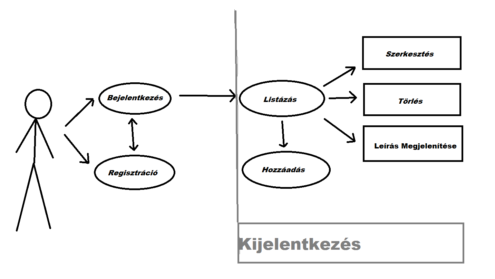
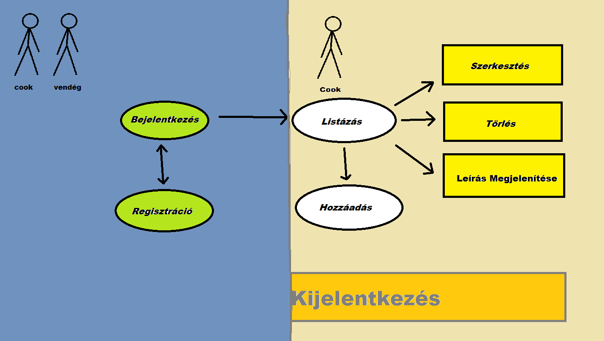
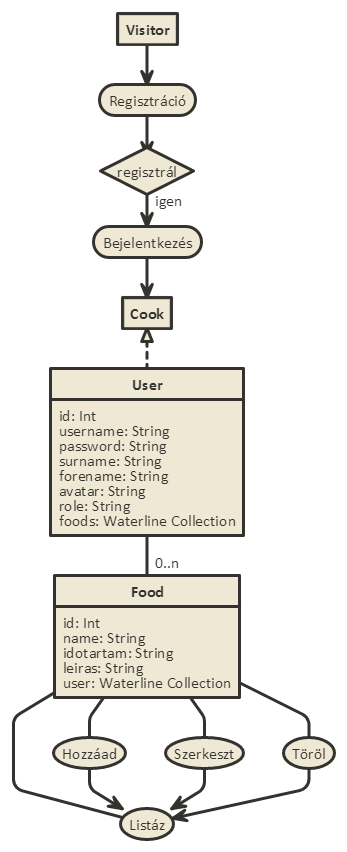
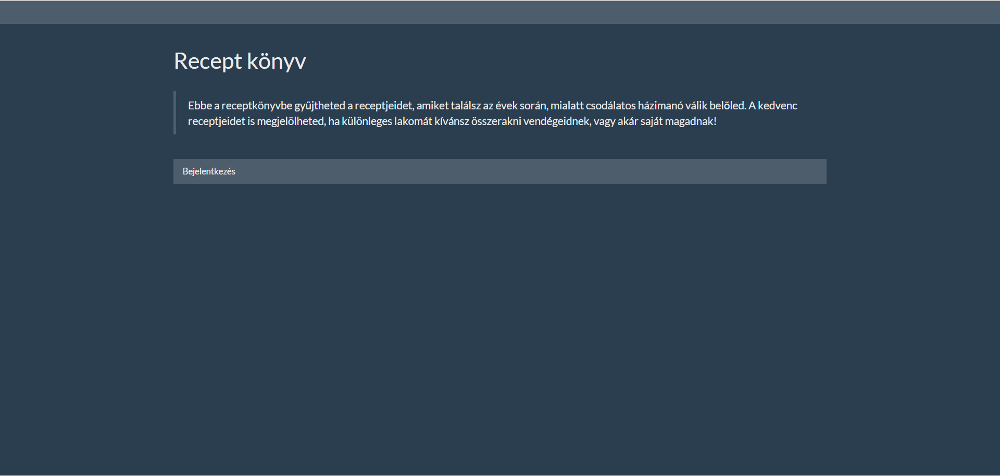
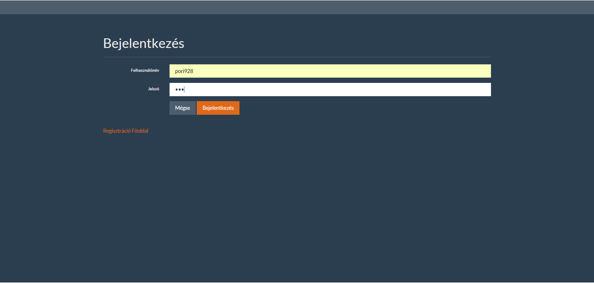
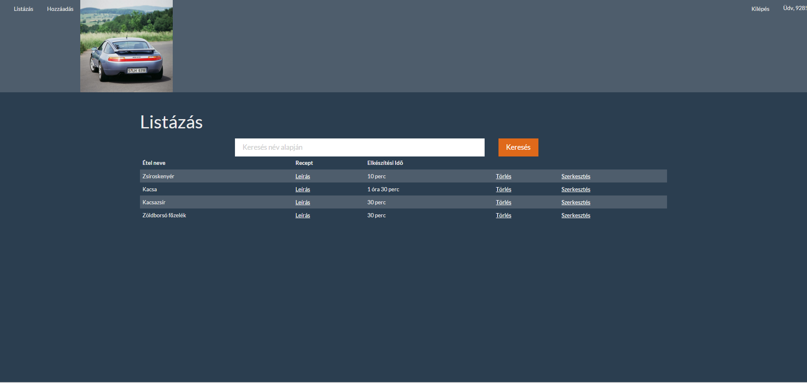
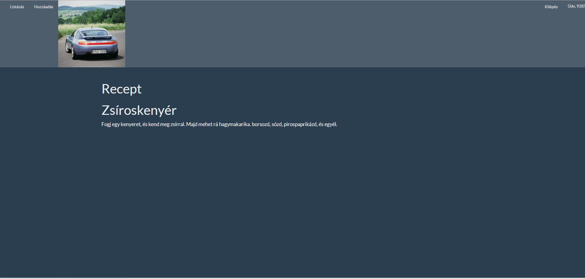
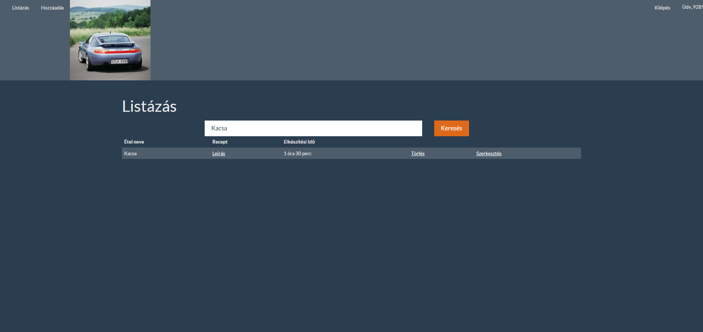

#Dokumentáció

##Követelményanalízis

###A program szolgáltatásai
  * Receptek felvétele
  * Receptek szerkesztése
  * Receptek törlése
  * Felhasználó Regisztrálása
  * Felvett receptek listázása, szűrése név szerint

Étel száma: egy globálisan egyedi azonosítója a receptnek.

Használatieset-modell:

Szerepkörök:
  * vendég: Olyan ember, aki még nem regisztrált. A bejelentkező lapon kívül nem láthat mást.
  * cook: egy átlagos felhasználó, aki a saját receptjeit tudja vezetni.

Használati eset diagramok: a szerepkörök és az elérhető funkiók kapcsolatát jelenítik meg, ha kell, akkor esetenként rövid magyarázó szöveggel.

###Hozzáadás
Étel hozzáadása a következőképpen történik.
A bejelentkezett felhasználó a lista űrlapon találja magát, ahol egy üres lista várja őt.
A Hozzáadás gombra kattintva felvehet egy új ételt az adatbázisba.
A kattintás után egy hozzáadás oldalon találja vamát a felhasználó, ahol megadhatja a nevét az ételnek. A név mező kötelező!
Továbbá az elkészítés időtartalmát is leírhatja, bármilyen szöveg formájában. Ha ezekkel végzett, a recept maga írható bele a leírás mezőbe.
Ha a felhasználó idő közben meggondolja magát, akkor kitörölheti az összes mező tartalmát a Mezők törlése gombbal. Ha viszont kész van az adatok bevitelével,
akkor a Hozzáadás gombbal mentheti el azokat. Ezután automatikusan a listázás oldalra kerül, ahol megtekintheti az újonnan bevitt listaelemét: a receptet.

##Tervezés

###Achitektúra terv
####Komponensdiagram és Oldaltérkép

####Végpontok
  * //GET / - főoldal: információk: info oldal
  * //GET /auth/login: bejelentkezés oldal
  * //POST /auth/login: bejelentkezés oldal - adatok elküldése, autentikácikó
  * //GET /auth/signup: regisztráció oldal
  * //POST /auth/signup: regisztráció oldal - adatok elküldése: /add
  * //GET /add - étel hozzáadása oldal betöltése
  * //POST /add - uj étel hozzáadása, ha a név nem üres
  * //GET /auth/logout: kijelentkezés: /auth/login oldalra vezet
  * //GET /list - összes étel listázása ?query-re szűrés
  * //GET /list/:id - 1db étel megjelenitese
  * //GET /description/:id - 1db étel részletes megjelenitese: recept oldalra navigál
  * //GET /edit/:id - adott étel szerkesztése: edit oldalra navigál
  * //POST /edit/:id - étel felvétele, majd a régi törlése miután megekereste
  * //ANY /delete/:id - adott étel törlése: list oldalra navigál

###Felhasználóifelület-modell
####Design-terv

##Implementáció

###Fejlesztői környezet
Cloud9 Web IDE: Cloud9 egyesít egy erős kód szerkesztőt és egy teljes Ubuntu munkakörnyezetet a felhőben

###Könyvtárstruktúra
* docs
  * images - képek, amiket a README.md használ
* models - kollekciók az apphoz
  * food.js - ételek
  * user.js - felhasználók
* node_modules - npm plugin-ok
* public - jQuery plugin scriptek
* Test - automatizált tesztek
* views - felhasználói felületnek a fájljai
  * auth - authentikációval kapcsolatos nézetek
    * login.hbs - login rész
    * signup.hbs - regisztrációs rész
  * partials - állandó ui elemek
    * menu.hbs - menú
    * messages.hbs - üzenetek
  * add.hbs - étel hozzáadása rész
  * edit.hbs - étel szerkesztése rész
  * info.hbs - főoldal
  * layout.hbs - alap szerkezete a megjelenítésnek
  * list.hbs - listázás rész
  * recept.hbs leírás rész
* index.js - ezzel indul el a webapplikáció. itt definiáljuk az összes npm plugint, amit használni fogunk, a portot, amin futni fog a szerver. session-öket hozunk létre, és segédfüggvényeket. stratégiákat definiálunk. Megadjuk a nézetek elérhetőségét, és a router elérhetőségét.
* package.json - ez a fájl tartalmazza az app konfiurálását.
* README.md - dokumentáció githubon
* router.js - útvonalak definiálása, http metódusokra való felregisztrálás.

##Tesztelés

A tesztelést Selenium IDE program segítségével végeztem el.

###Egységtesztek: legalább 1 adatmodell tesztelése
* Unit test - food: a food collection paramétereinek tesztelése.

###Funkcionális felületi tesztek: legalább 1 folyamat tesztelése
* Basic Flow: alap működés tesztelése

###Teszt esetek felsorolása
* Regisztráció: test névvel
* listázás
* hozzáadás
* szerkesztés
* leírás megtekintése
* üres név mezővel való hozzáadás és szerkesztés
* törlés
* kilépés

##Felhasználói dokumentáció

###Futtatáshoz
* Böngésző
* Intenet kapcsolat

Hardver:
Olyan számítógép, ami tud böngészőt futtatni.

Githubon a Download .zip-re kattintva letölthető az alkalmazás.

####A program használata
#####Hozzáadás
Étel hozzáadása a következőképpen történik.
A bejelentkezett felhasználó a lista űrlapon találja magát, ahol egy üres lista várja őt.
A Hozzáadás gombra kattintva felvehet egy új ételt az adatbázisba.
A kattintás után egy hozzáadás oldalon találja vamát a felhasználó, ahol megadhatja a nevét az ételnek. A név mező kötelező!
Továbbá az elkészítés időtartalmát is leírhatja, bármilyen szöveg formájában. Ha ezekkel végzett, a recept maga írható bele a leírás mezőbe.
Ha a felhasználó idő közben meggondolja magát, akkor kitörölheti az összes mező tartalmát a Mezők törlése gombbal. Ha viszont kész van az adatok bevitelével,
akkor a Hozzáadás gombbal mentheti el azokat. Ezután automatikusan a listázás oldalra kerül, ahol megtekintheti az újonnan bevitt listaelemét: a receptet.

#####Keresés
Írd be a keresendő étel teljes nevét, ügyelve a kis és nagybetűkre. A kereső egy darab ételt fog listázni.

#####Szerkesztés
Nyomja meg a listaelemnél a Szerkesztés gombot, ami elirányítja majd a szerkesztés oldalra, ahol már be vannak gépelve az étel adatai. ezeket módosíthatja, csak az étel nevét ne hagyja üresen.
Az étel számát nem lehet szerkeszteni.

#####Törlés
Ha törölni szeretne egy receptet, akkor nyomaj megx a megfelelő étel neve melletti Törlés gombot.

#####Kijelentkezés
Kijelentkezni a jobb felső sarokban lévő Kijelentkezés gombbal lehet.

#####Regisztráció
Adja meg az adatait a regisztráció sikeressége érdekében.
Megadhat képet is, ami majd meg fog jelenni minden bejelentkezés alkalmával.